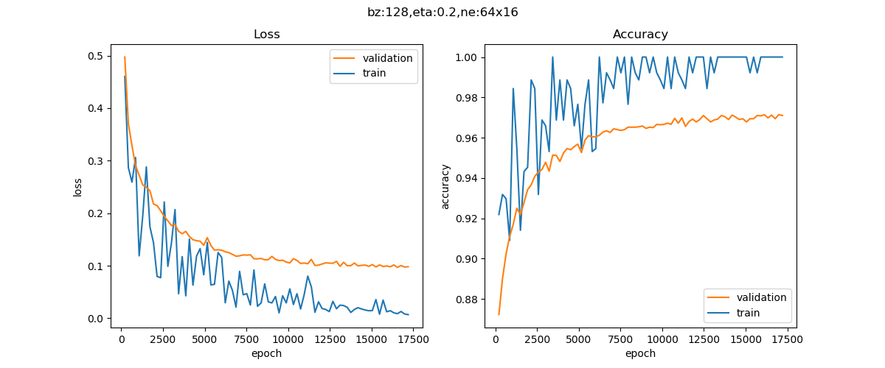

## 三层神经网络的实现

### 定义神经网络

为了完成MNIST分类，我们需要设计一个三层神经网络结构，如图所示。


<center>三层神经网络结构</center>

#### 输入层

28x28=784个特征值：

$$
X=\begin{pmatrix}
    x_1 & x_2 & ... & x_{784}
  \end{pmatrix}
$$

#### 隐层1

- 权重矩阵w1形状为784x64

$$
W1=\begin{pmatrix}
    w1_{1,1} & w1_{1,2} & ... & w1_{1,64} \\
    ... & ... & & ... \\
    w1_{784,1} & w1_{784,2} & ... & w1_{784,64} 
  \end{pmatrix}
$$

- 偏移矩阵b1的形状为1x64

$$
B1=\begin{pmatrix}
    b1_{1} & b1_{2} & ... & b1_{64}
  \end{pmatrix}
$$

- 隐层1由64个神经元构成，其结果为1x64的矩阵

$$
Z1=\begin{pmatrix}
    z1_{1} & z1_{2} & ... & z1_{64}
  \end{pmatrix}
$$
$$
A1=\begin{pmatrix}
    a1_{1} & a1_{2} & ... & a1_{64}
  \end{pmatrix}
$$

#### 隐层2

- 权重矩阵w2形状为64x16

$$
W2=\begin{pmatrix}
    w2_{1,1} & w2_{1,2} & ... & w2_{1,16} \\
    ... & ... & & ... \\
    w2_{64,1} & w2_{64,2} & ... & w2_{64,16} 
  \end{pmatrix}
$$

- 偏移矩阵b2的形状是1x16

$$
B2=\begin{pmatrix}
    b2_{1} & b2_{2} & ... & b2_{16}
  \end{pmatrix}
$$

- 隐层2由16个神经元构成

$$
Z2=\begin{pmatrix}
    z2_{1} & z2_{2} & ... & z2_{16}
  \end{pmatrix}
$$
$$
A2=\begin{pmatrix}
    a2_{1} & a2_{2} & ... & a2_{16}
  \end{pmatrix}
$$

#### 输出层

- 权重矩阵w3的形状为16x10

$$
W3=\begin{pmatrix}
    w3_{1,1} & w3_{1,2} & ... & w3_{1,10} \\
    ... & ... & & ... \\
    w3_{16,1} & w3_{16,2} & ... & w3_{16,10} 
  \end{pmatrix}
$$

- 输出层的偏移矩阵b3的形状是1x10

$$
B3=\begin{pmatrix}
    b3_{1}& b3_{2} & ... & b3_{10}
  \end{pmatrix}
$$

- 输出层有10个神经元使用Softmax函数进行分类

$$
Z3=\begin{pmatrix}
    z3_{1} & z3_{2} & ... & z3_{10}
  \end{pmatrix}
$$
$$
A3=\begin{pmatrix}
    a3_{1} & a3_{2} & ... & a3_{10}
  \end{pmatrix}
$$

### 前向计算

我们都是用大写符号的矩阵形式的公式来描述，在每个矩阵符号的右上角是其形状。

#### 隐层1

$$Z1 = X \cdot W1 + B1 \tag{1}$$

$$A1 = Sigmoid(Z1) \tag{2}$$

#### 隐层2

$$Z2 = A1 \cdot W2 + B2 \tag{3}$$

$$A2 = Tanh(Z2) \tag{4}$$

#### 输出层

$$Z3 = A2 \cdot W3  + B3 \tag{5}$$

$$A3 = Softmax(Z3) \tag{6}$$

我们的约定是行为样本，列为一个样本的所有特征，这里是784个特征，因为图片高和宽是28x28，总共784个点，把每一个点的值做为特征向量。

两个隐层，分别定义64个神经元和16个神经元。第一个隐层用Sigmoid激活函数，第二个隐层用Tanh激活函数。

输出层10个神经元，再加上一个Softmax计算，最后有a1,a2,...a10十个输出，分别代表0-9的10个数字。

### 反向传播

和以前的两层网络没有多大区别，只不过多了一层，而且用了tanh激活函数，目的是想把更多的梯度值回传，因为tanh函数比sigmoid函数稍微好一些，比如原点对称，零点梯度值大。

#### 输出层

$$dZ3 = A3-Y \tag{7}$$
$$dW3 = A2^T \cdot dZ3 \tag{8}$$
$$dB3=dZ3 \tag{9}$$

#### 隐层2

$$dA2 = dZ3 \cdot W3^T \tag{10}$$
$$dZ2 = dA2 \odot (1-A2 \odot A2) \tag{11}$$
$$dW2 = A1^T \cdot dZ2 \tag{12}$$
$$dB2 = dZ2 \tag{13}$$

#### 隐层1

$$dA1 = dZ2 \cdot W2^T \tag{14}$$
$$dZ1 = dA1 \odot A1 \odot (1-A1) \tag{15}$$
$$dW1 = X^T \cdot dZ1 \tag{16}$$
$$dB1 = dZ1 \tag{17}$$

### 运行结果

损失函数值和准确度值变化曲线如图。



<center>训练过程中损失函数和准确度的变化</center>

打印输出部分：

```
...
epoch=38, total_iteration=16769
loss_train=0.012860, accuracy_train=1.000000
loss_valid=0.100281, accuracy_valid=0.969400
epoch=39, total_iteration=17199
loss_train=0.006867, accuracy_train=1.000000
loss_valid=0.098164, accuracy_valid=0.971000
time used: 25.697904109954834
testing...
0.9749
```

在测试集上得到的准确度为97.49%，比较理想。

